# Files Description
## shs.csv
* Regularly updated [Steam Hardware Survey Data](https://store.steampowered.com/hwsurvey/Steam-Hardware-Software-Survey-Welcome-to-Steam)

* Data from 2008-11-01 - now (data before ca. 2020 was collected through web.archive)

* The Python script includes functions to collect the current months steam hardware survey data or past data from web.archive.org

## shs_platform.csv

* Regularly updated platform dependent [data](https://store.steampowered.com/hwsurvey?platform=pc). Fetches Linux, Mac & PC.

* Data from ca. 2010-06-01 - now (data before 2023-11 was collected through web.archive with some months/platform combinations missing. No Linux data exists before 2014 in the archive.)

* The Python script includes functions to collect the current months steam hardware survey data or past data from web.archive.org

# Infos

## Watchouts & Known Discrepancies

* As mentioned by [luxzg](https://github.com/jdegene/steamHWsurvey/issues/1): some video card names have stuff like "(R)" or "Series" added to the names, and thus could introduce duplicates to the data

* After an initial release of December 2022 hardware data that showed [some odd discrepancies](https://archive.is/XyyNP), Steam reuploaded a revised dataset. The current shs.csv uses the revised data (original data can be found in first commit for December 2022 data)

* Data from March 2023 (= posted in April 2023 on the steam website) saw unusual spikes in several areas (like growth in "Language: Simplified Chinese" or "Intel CPU" share amongst others). The reason was never officially addressed (but may be due to similar reasons as pointed in official statements by steam below) nor was the data updated during the span April on the website. With the April data update in May, these outliers have seemed to be mitigated and numbers are closer to prior months.

* As mentioned by [likudo](https://github.com/jdegene/steamHWsurvey/issues/4) the raw data omits the category "others". Creating a category sum can as such create misleading results. Refer to the platform specific data instead.

* As mentioned by [mrxz](https://github.com/jdegene/steamHWsurvey/issues/5) the data did not include "total rows", as in "Steam users with VR Headsets" which represent the normal stat across all users while the actual stats per VR Headset are relative to this totals number. As of September 2024 the total rows are included in the data (currently only relevant for VR Headsets), be careful when calculating sums across entire categories as the result might be misleading.

* Data from December 2024 (uploaded January 2025) did show larger inconsistencies as mentioned by [Devaniti](https://github.com/jdegene/steamHWsurvey/issues/6), where sums can add up to mathmatically incorrect >100%. The data remained as is throughout January (i.e. was not revised by Steam). The following February upload (of January 2025 data) seems to be correct again, and was changed around February 19th 2025 by Steam to account for correct changes in relation to December (e.g. the first entry for Windows 11 from beginning of February changed from  "-0.0150,0.5346" to "0.0034,0.5346" at that date). The current dataset contains the revised data from February 19th 2025 AND the recalculated values for December 2024 using the revised changes. For a pre-calculated version of December 2024 data see commit #7017769

## Official Information posted on the Steam Hardware Survey Site

STEAM HARDWARE SURVEY FIX – 5/2/2018

The latest Steam Hardware Survey incorporates a number of fixes that address over counting of cybercafé customers that occurred during the prior seven months.

Historically, the survey used a client-side method to ensure that systems were counted only once per year, in order to provide an accurate picture of the entire Steam user population. It turns out, however, that many cybercafés manage their hardware in a way that was causing their customers to be over counted.

Around August 2017, we started seeing larger-than-usual movement in certain stats, notably an increase in Windows 7 usage, an increase in quad-core CPU usage, as well as changes in CPU and GPU market share. This period also saw a large increase in the use of Simplified Chinese. All of these coincided with an increase in Steam usage in cybercafés in Asia, whose customers were being over counted in the survey.

It took us some time to root-cause the problem and deploy a fix, but we are confident that, as of April 2018, the Steam Hardware Survey is no longer over counting users. 

-------------------------------------------------------------------------------------------------------------------------------------------------------------------------
(2012-06)

Why do many of the Steam Hardware Survey numbers seem to undergo a significant change in April 2012?

There was a bug introduced into Steam's survey code several months ago that caused a bias toward older systems. Specifically, only systems that had run the survey prior to the introduction of the bug would be asked to run the survey again. This caused brand-new systems to never run the survey. In March 2012, we caught the bug, causing the survey to be run on a large number of new computers, thus giving us a more accurate survey and causing some of the numbers to vary more than they normally would month-to-month. Some of the most interesting changes revealed by this correction were the increased OS share of Windows 7 (as Vista fell below XP), the rise of Intel as a graphics provider and the overall diversification of Steam worldwide (as seen in the increase of non-English language usage, particularly Russian). 

# Graphs 

Graphs are auto-generated with every data update 

## GPUs 
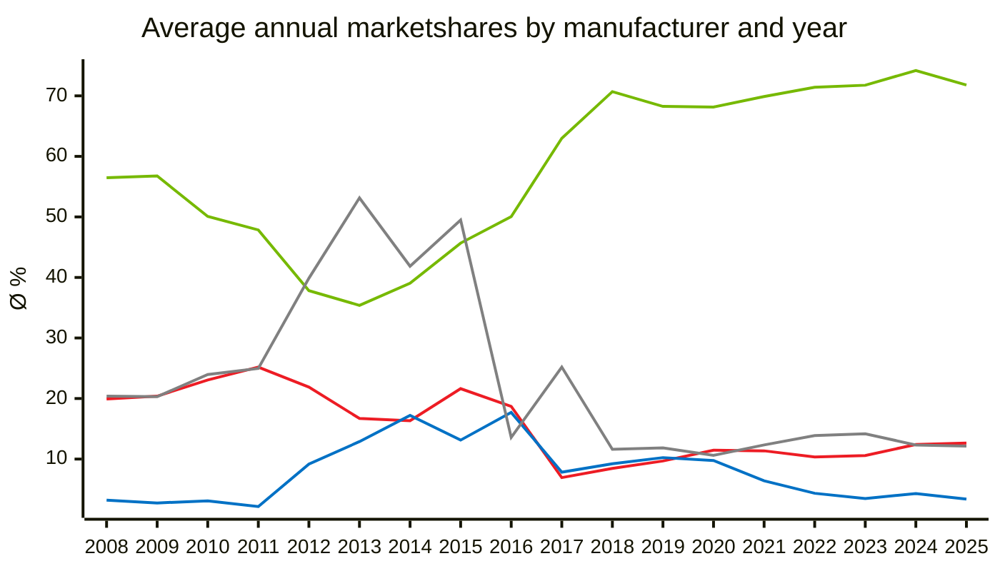
$${\color{#76b900}NIVIDA\space\space\space
\color{#ED1C24}AMD\space\space\space
\color{#0071C5}Intel\space\space\space
\color{#808080}Other\space\space\space}$$

 

### NVIDIA Generation Comparison

Compare GPUs across Generations, first month a GPU appears in Steam Hardware Survey = month 0.
Combines all variants, eg. 4060, 4060 Laptop GPU, 4060 Ti are all grouped in 4060.

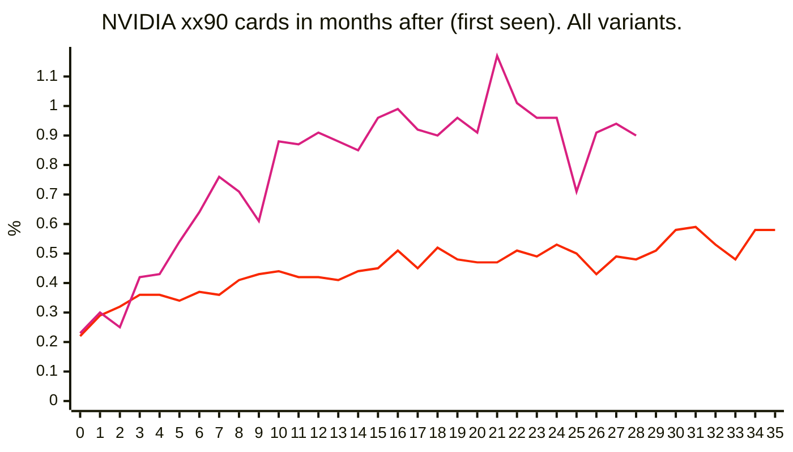
$${\color{#51a8a6}---\space(--)\space\space\space\color{#f9a900}---\space(--)\space\space\space\color{#f92800}3090\space(Jan \space 2021)\space\space\space\color{#d92080}4090\space(Jan \space 2023)\space\space\space\color{#8a52a6}5090\space(--)\space\space\space}$$

 

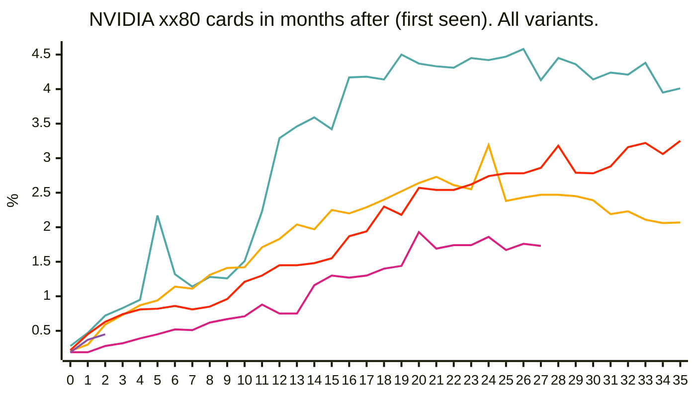
$${\color{#51a8a6}1080\space(Jul \space 2016)\space\space\space\color{#f9a900}2080\space(Dec \space 2018)\space\space\space\color{#f92800}3080\space(Nov \space 2020)\space\space\space\color{#d92080}4080\space(Feb \space 2023)\space\space\space\color{#8a52a6}5080\space(Mar \space 2025)\space\space\space}$$

 

$${\color{#51a8a6}1070\space(Jul \space 2016)\space\space\space\color{#f9a900}2070\space(Dec \space 2018)\space\space\space\color{#f92800}3070\space(Mar \space 2021)\space\space\space\color{#d92080}4070\space(Feb \space 2023)\space\space\space\color{#8a52a6}5070\space(Apr \space 2025)\space\space\space}$$

 

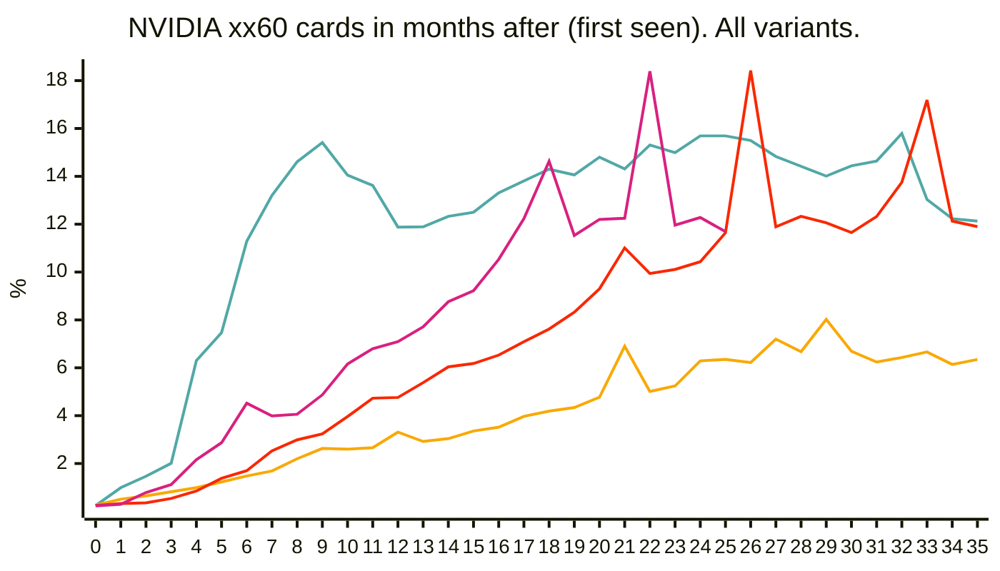
$${\color{#51a8a6}1060\space(Aug \space 2016)\space\space\space\color{#f9a900}2060\space(Mar \space 2019)\space\space\space\color{#f92800}3060\space(Jan \space 2021)\space\space\space\color{#d92080}4060\space(Apr \space 2023)\space\space\space\color{#8a52a6}5060\space(May \space 2025)\space\space\space}$$

 

### AMD Generation Comparison

Compare GPUs across Generations, first month a GPU appears in Steam Hardware Survey = month 0.
Grouping is a bit less straight forward than with NVIDIA cards because of the naming shifts

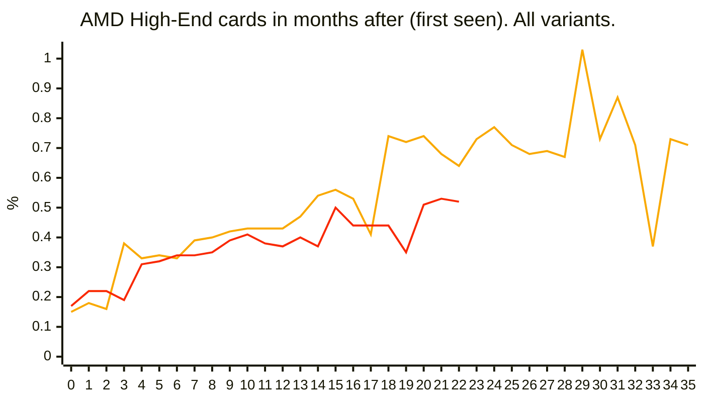
$${\color{#51a8a6}---\space(---)\space\space\space\color{#f9a900}6800|6900|6950\space(Apr \space 2022)\space\space\space\color{#f92800}7900\space(Jul \space 2023)\space\space\space\color{#d92080}9090\space(---)\space\space\space}$$

 

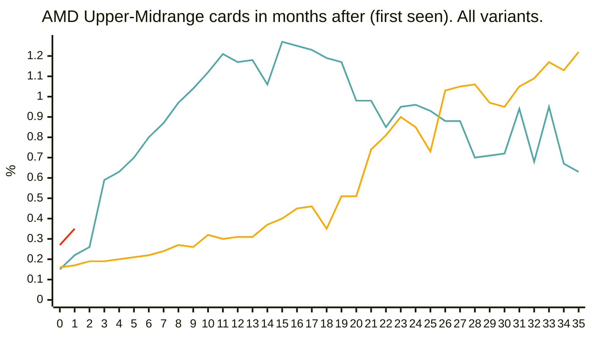
$${\color{#51a8a6}5700\space(Oct \space 2019)\space\space\space\color{#f9a900}6700|6750\space(Sep \space 2021)\space\space\space\color{#f92800}7800\space(Apr \space 2025)\space\space\space\color{#d92080}9080\space(---)\space\space\space}$$

 

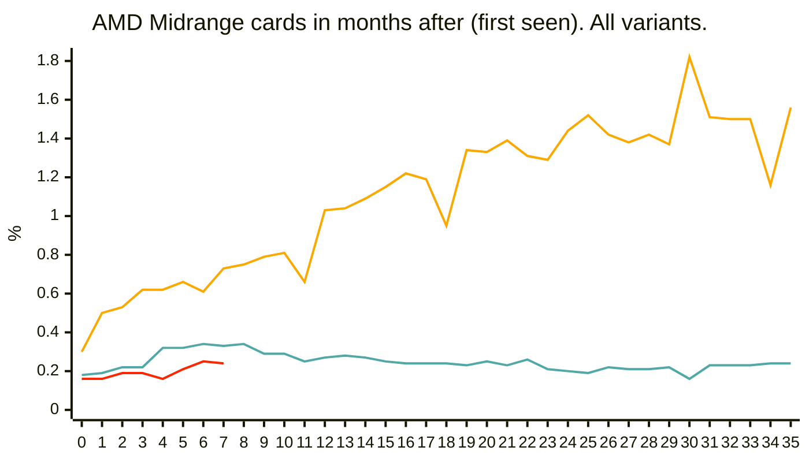
$${\color{#51a8a6}5600\space(Sep \space 2020)\space\space\space\color{#f9a900}6600|6650\space(Apr \space 2022)\space\space\space\color{#f92800}7700\space(Oct \space 2024)\space\space\space\color{#d92080}9070\space(---)\space\space\space}$$

 

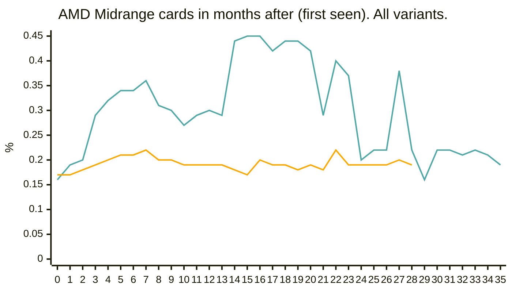
$${\color{#51a8a6}5500\space(Oct \space 2020)\space\space\space\color{#f9a900}6400|6500\space(Sep \space 2022)\space\space\space\color{#f92800}7600|7650\space(---)\space\space\space\color{#d92080}9060\space(---)\space\space\space}$$

 

## Resolution 
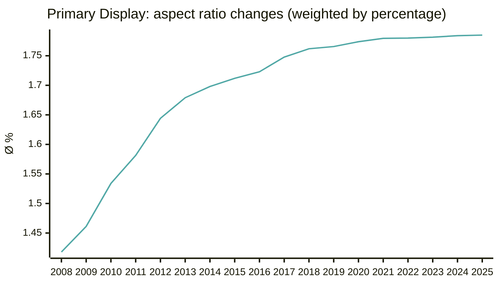
$${\color{#51a8a6} For \space reference \space 1920*1080 \space ratio \space = \space 1.77 \space pixels \space}$$

 

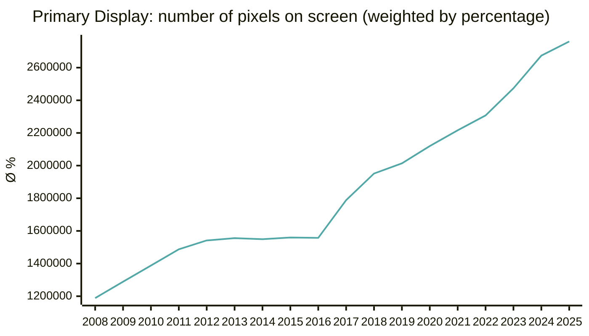
$${\color{#51a8a6} For \space reference \space 1920*1080 \space = \space 2.073.600 \space pixels \space}$$

 

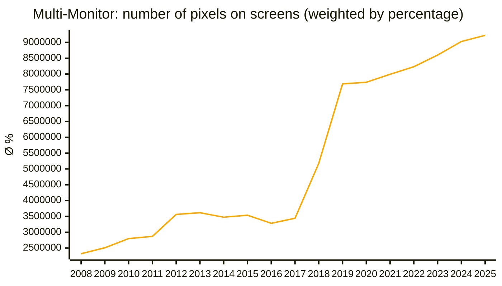
$${\color{#f9a900} For \space reference \space 2x \space 1920*1080 \space = \space 4.147.200 \space pixels \space}$$

 

